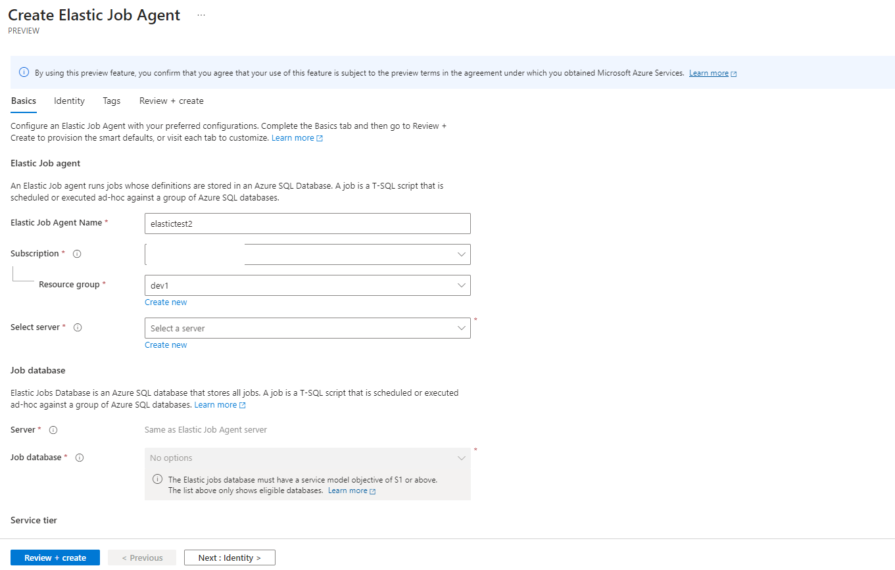
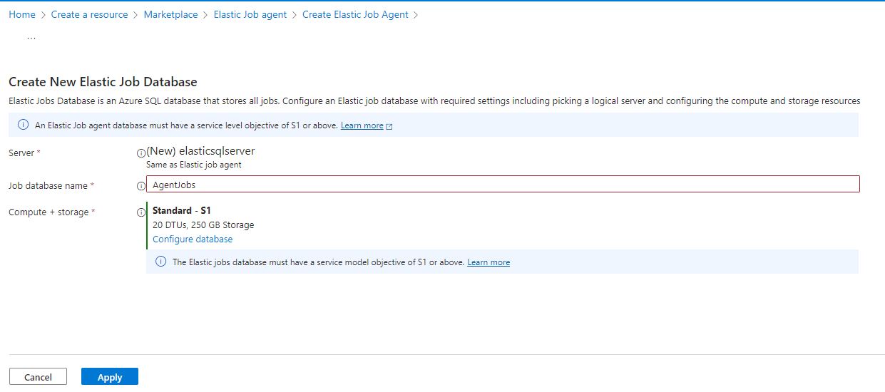
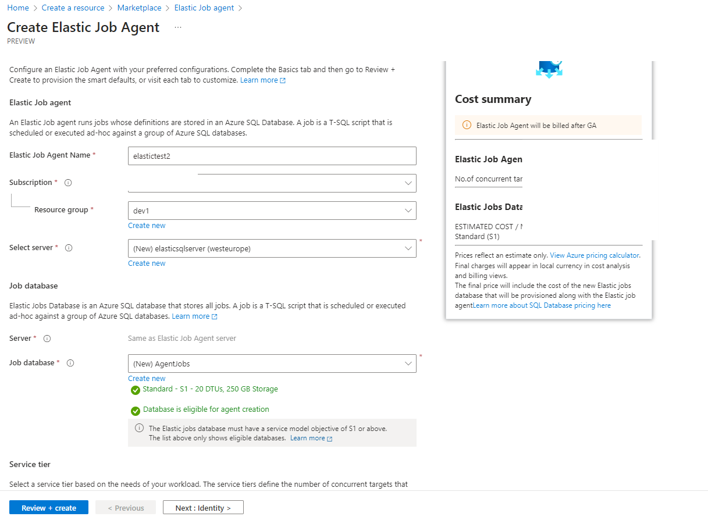

# Create Elastic Job agent resource in Azure



Follow the steps below to create elastic jobs in Azure:
### Select Azure Elastic Jobs resource in Azure portal:
   - Open the [Azure portal](https://portal.azure.com/) and search for [Azure Elastic Jobs](https://portal.azure.com/#create/Microsoft.SQLElasticJobAgentg):
   - Define a unique Elastic Job agent name.
   - Select the Subscription and Resource group.

      

### Configure the Elastic Job agent:
   - Choose the Azure SQL Database server and Job database.
   - Select the Service tier for the Job database (S1 or above).
   - Optional settings:
     - Configure Managed identity and Tags.
     - Enable Geo-redundancy for regional failover (optional, increases cost).
     - Choose the Storage redundancy level (LRS, GRS, GZRS).

      

### Create a new job database:
   - Define the Job database name.
   - Choose the Compute + storage tier (default: Standard - S1).
   - Optional settings:
     - Configure database for further customization (service tier, backup, threat protection).

      

### Review and create:
   - Review the summary of your chosen configurations.
   - Click Review + create to provision the Elastic Job Agent.
   - Optionally use Previous to edit earlier settings.

      

