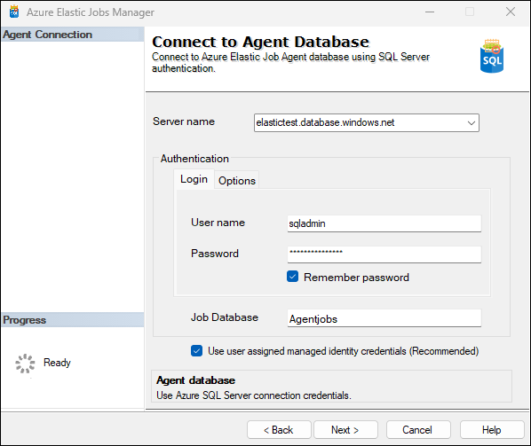

# Connecting to Azure Elastic Job Database
The **Login Screen** allows users to connect to an Azure SQL database where elastic jobs are configured. Users need to provide login details with minimum permissions to manage elastic jobs. The authentication method used is SQL Server Authentication.

### Connection Details

1. **Server Name**
   - Enter the server name of your Azure SQL elastic job database in the `Server name` field.

2. **Authentication**
   - Select `SQL Server Authentication` from the dropdown menu.
   - Enter your username in the `User name` field.
   - Enter your password in the `Password` field.
   - Optionally, check the 'Remember password' box if you want the application to remember your login credentials.
   - Click on `Options`.
   - Under `Connection Properties`, ensure that:
        - `Encrypt connection` is checked if you want to encrypt data sent between your application and SQL Database over the network.
        - `Trust server certificate` is checked if you trust your server’s SSL certificate and want to bypass verification.
		- `Connection Timeout` is the timeout period (in seconds) during which a connection attempt will be made before it’s terminated.

4. **Job Database**
    – Specify name of the elastic job database.

5. `Use user assigned managed identity credentials` option will use UMI credentials to authenticate target databases during job executions. Check this option only if you have enabled user assgined managed identity in Elastic jobs in Azure portal. 

6. Click `Next` to Connect.

{: .note } 
Ensure that permissions are set up appropriately, adhering to the principle of least privilege, granting only necessary permissions needed for elastic jobs operations.
