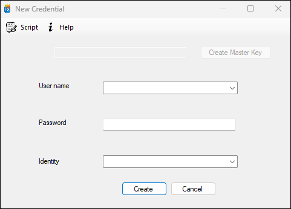

# Managing credentials
Optional
{: .label .label-blue }
Credentials are essential for accessing and managing elastic jobs effectively but are not required when user-assigned managed identity is enabled.
The **New Credential** screen is launched when a user clicks on "Create Credentials". This interface is used for creating credentials for elastic jobs. Note that these credentials are only relevant when elastic jobs do not have user assigned managed identity enabled.

   

### Create Master Key 
- Master key must be created before creating scoped-credentials in elastic jobs database.

### Create database-scoped credentials

 **User Name**: A text field where users enter the username associated with the credential.

**Password**: A text field for entering the password. It's masked for security purposes. 

**Identity**: A text field for entering identity associated with the credentials.

{: .note } 
The identity and password used to create the credentials should match exactly with the user created in each target database.

