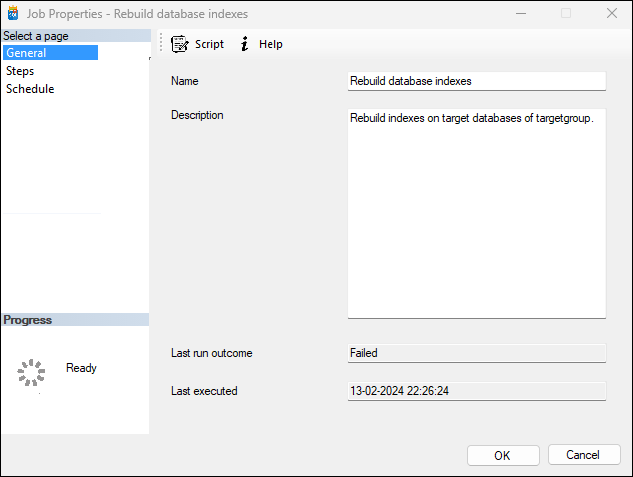

# Create or alter the job
{: .no_toc }
## Table of contents
{: .no_toc .text-delta }

1. TOC
{:toc}

## Navigation
{: .no_toc }
   - On the top panel, select `New Job` to open the job creation window.
   - Or double-click on an existing job to edit the job.
   - Or right-click on an existing job and click on `Properties` to edit the job.

   

1. **General Information**
   - **Name:** Enter the name of your job in the `Name` field.
   - **Description:** Provide description of your job in the `Description` field.

2. **Job Execution Details**
   - **Last Run Outcome:** This field will display the outcome of the last run once the job has been executed.
   - **Last Executed:** Indicates when this particular job was last executed.
     
4. **Script & Help Options**
   - Click on `Script` if you want to script the changes made in the job. This is a SQL script that will be executed against the agent job database when users saves job changes.
   - Click on `Help` for assistance and documentation related to this interface.

5. **Save or Cancel**
   - Click `OK` to save and create or alter the job.
   - Click `Cancel` to discard the changes.

{: .note }
Ensure all required fields are filled out before clicking "OK" to avoid errors and ensure smooth creation of your new Azure elastic jobs.

---

