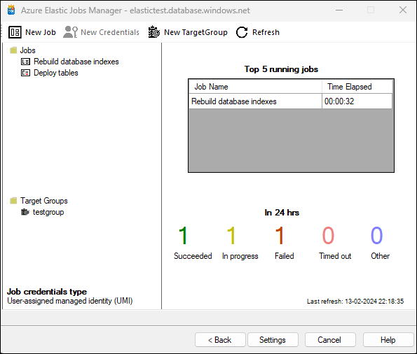

Upon logging in to the Azure Elastic Job database, users are presented with the landing screen of Azure Elastic Jobs Manager. This interface serves as the central hub for managing and monitoring various jobs and target groups.

## Interface Elements

### Top Menu Bar
- **New Job**: Allows users to create a new job.
- **New Credentials**: Enables users to add new credentials.
- **New Target Group**: Users can create a new target group.
- **Refresh**: Refreshes the current view.

### Jobs Section
Lists all existing jobs with their names and statuses:

### Target Groups Section
Displays all target groups:

### Job Credentials Type 
Indicates the type of job credentials being used. This can be User-assigned managed identity (UMI) or Database-scoped credentials.

### Top 5 Running Jobs 
Displays information about the top 5 running jobs including:
   - Job Name 
   - Time Elapsed 

### Job Status Indicators 
Shows job statuses in various colors indicating:
    - Succeeded (Green)
    - In Progress (Yellow)
    - Failed (Red)
    - Timed Out (Pink)
    - Other (Blue)

Each status is also accompanied by a count of jobs in that particular state within the last 24 hours.

## Navigation Buttons 
At the bottom, there are navigation buttons including Back, Settings, Cancel, and Help for additional options and navigation.

