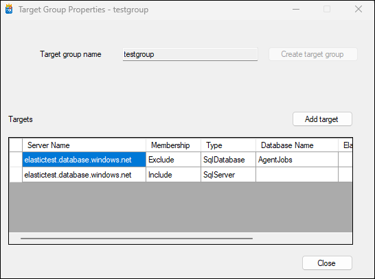

# Managing target group

## Overview
The **Create Target Group** screen allows users to create a new target group. Once the target group is created, users can add specific targets (databases) where jobs will be executed.

   

## Steps to Create a Target Group and Add Targets

1. **Navigate to the Create Target Group Screen**
   - Click on "Create Target Group" to open this interface.

2. **Enter the Target Group Name**
   - In the "Target group name" field, enter a unique and descriptive name for your new target group.

3. **Create the Target Group**
   - Click on the “Create target group” button after entering the desired name.
   - The system will validate if a similar named group exists or not, ensuring uniqueness.

4. **Add Targets (Post-Creation)**
    - Once the target group is created, options become available for adding targets.
    - Click on “Add target” and follow subsequent prompts to add databases where jobs will be executed.

## Fields and Options

- **Target group name:** A text field for entering the name of your new target group.
- **Permission script:** An optional feature allowing users to attach permission scripts if necessary.
- **Add target:** This option becomes available post creation of a target group, allowing users to add specific targets or databases.

### Closing Interface
Click on “Close” button at bottom right corner of screen to exit out of this interface and return back to previous menu or dashboard.
