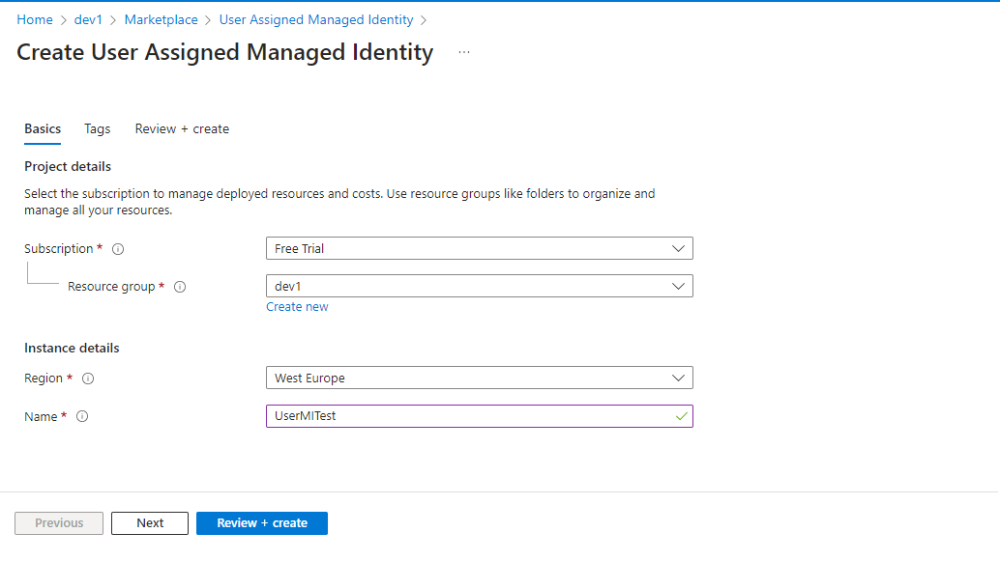
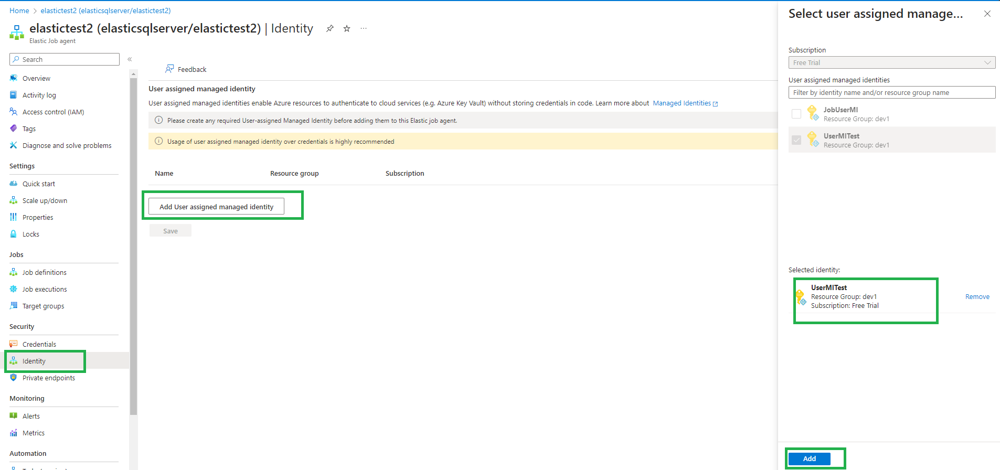

# Grant permission to Elastic jobs database
This section outlines the process of granting permissions within the Azure Elastic Jobs Database by creating users and assigning them specific roles. These roles dictate the level of access and the actions users can perform within the database environment.

### Creating Jobs manager User:

```sql
CREATE USER jobsmanager WITH PASSWORD = '<strong_password>';
EXEC sp_addrolemember 'jobs_resource_manager', 'jobsmanager';
```
Creates a user 'jobsmanager' with a strong password and assigns the 'jobs_resource_manager' role to enable management of resources in the Elastic Jobs Database.

### Creating Jobs Reader User

```sql
CREATE USER jobsreader WITH PASSWORD = '<strong_password>';
EXEC sp_addrolemember 'jobs_reader', 'jobsreader'
```
Creates a user 'jobsreader' with a strong password and grants access by assigning the 'jobs_reader' role. This role is specifically designed to provide read access to Elastic Jobs objects, making it useful for tasks like job monitoring.

### Creating Jobs Admin User

```sql
CREATE USER jobsadmin WITH PASSWORD = '<strong_password>';
EXEC sp_addrolemember 'jobs_admin', 'jobsadmin'
```
Creates a user 'jobsadmin' with a strong password and assigns the 'jobs_admin' role for administrative privileges in the Elastic Jobs Database.

# Enable User Assigned Managed Identity for Elastic Job Agent (Recommended)

This section provides guidance on the recommended practice of integrating a user-assigned managed identity with the Azure Elastic Job Agent. This approach enhances security and streamlines authentication processes within your Elastic Jobs environment.

## Create User Assigned Managed Identity Resource in Azure

This step outlines the process of creating a user-assigned managed identity within the Azure portal. If such an identity already exists, skip this step. However, if the identity is not present, proceed with creating it. Once established, this managed identity can be associated with the Elastic Job Agent, facilitating secure authentication with other Azure resources.

1. Navigate to the Azure portal and create a User Assigned Managed Identity resource [here](https://portal.azure.com/#create/Microsoft.ManagedIdentity).
2. Provide a name for the UMI, review the options, and click 'Review + create'.

      

## Add User Assigned Managed Identity to Elastic Job Agent

1. Access the Elastic Job Agent resource in the Azure portal. Navigate to the 'Identity' option under the security section.
2. Click the 'Add User Assigned Managed Identity' button.
3. Select the desired UMI from the options and click 'Add'.
4. Save your changes.

      

Please note that only one UMI can be added to an Elastic Job Agent.


