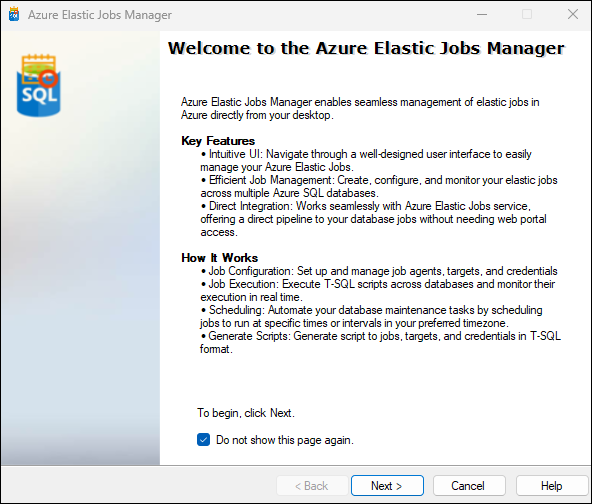

# Azure Elastic Jobs Manager

Azure Elastic Jobs Manager enables seamless management of Elastic Jobs in Azure directly from your desktop. This tool serves as an extension to Visual Studio versions 2017, 2019, and 2022, as well as SQL Server Management Studio versions 18 and 19, streamlining the process of overseeing your elastic job deployments.
{: .fs-6 .fw-300 }

## Key Features
- **Intuitive UI**: Navigate through a well-designed user interface to easily manage your Azure Elastic Jobs.
- **Efficient Job Management**: Create, configure, and monitor your Elastic jobs across multiple Azure SQL databases.
- **Direct Integration**: Works seamlessly with Azure Elastic Jobs service, offering a direct pipeline to your database jobs without needing web portal access.

## How It Works
- **Job Configuration**: Set up and manage job agents, targets, and credentials directly within Visual Studio.
- **Job Execution**: Execute T-SQL scripts across a collection of databases and monitor their performance in real time.
- **Scheduling**: Automate your database maintenance tasks by scheduling jobs to run at specific times or intervals in your preferred timezone.

## Getting Started
1. **Install the Extension**: Get started by [installing](https://elasticjobsmanager.azureops.org/docs/installation.html)  the extension.
2. **Connect to Azure**: [Connect](https://elasticjobsmanager.azureops.org/docs/features/authentication.html) your Azure elastic jobs database to manage elastic jobs effortlessly.
3. **Explore Documentation**: [Refer](https://elasticjobsmanager.azureops.org/docs/features) to our detailed documentation for step-by-step guides.

Leverage the power of Azure Elastic Jobs with the convenience of your desktop environment. Download the Azure Elastic Jobs Manager extension today and take the first step toward efficient database management!
